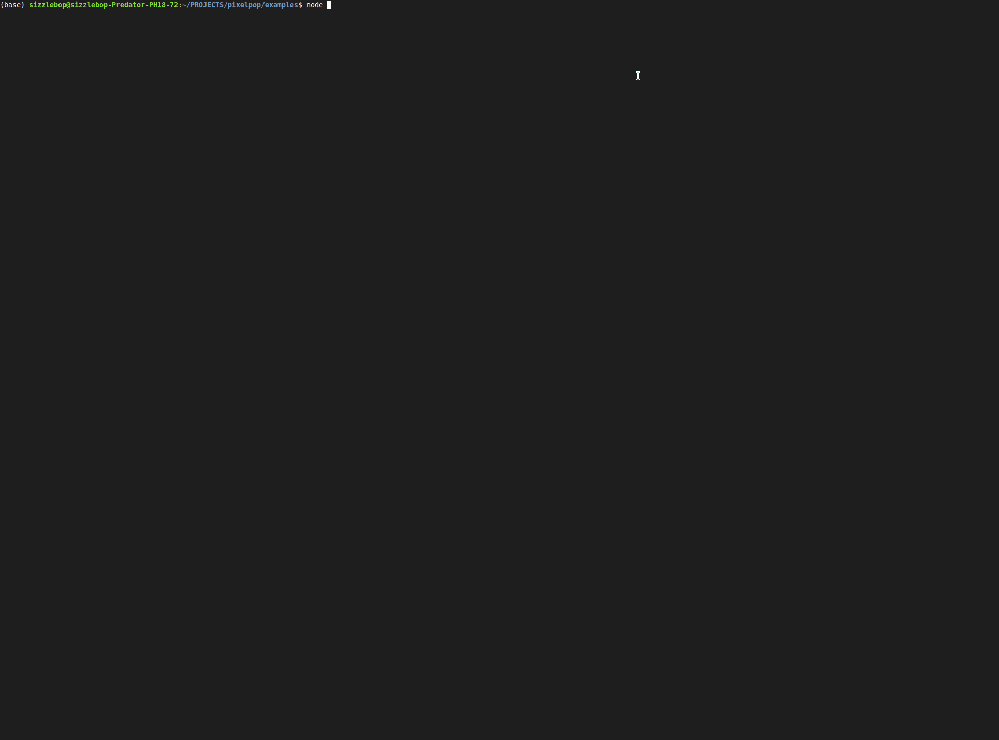
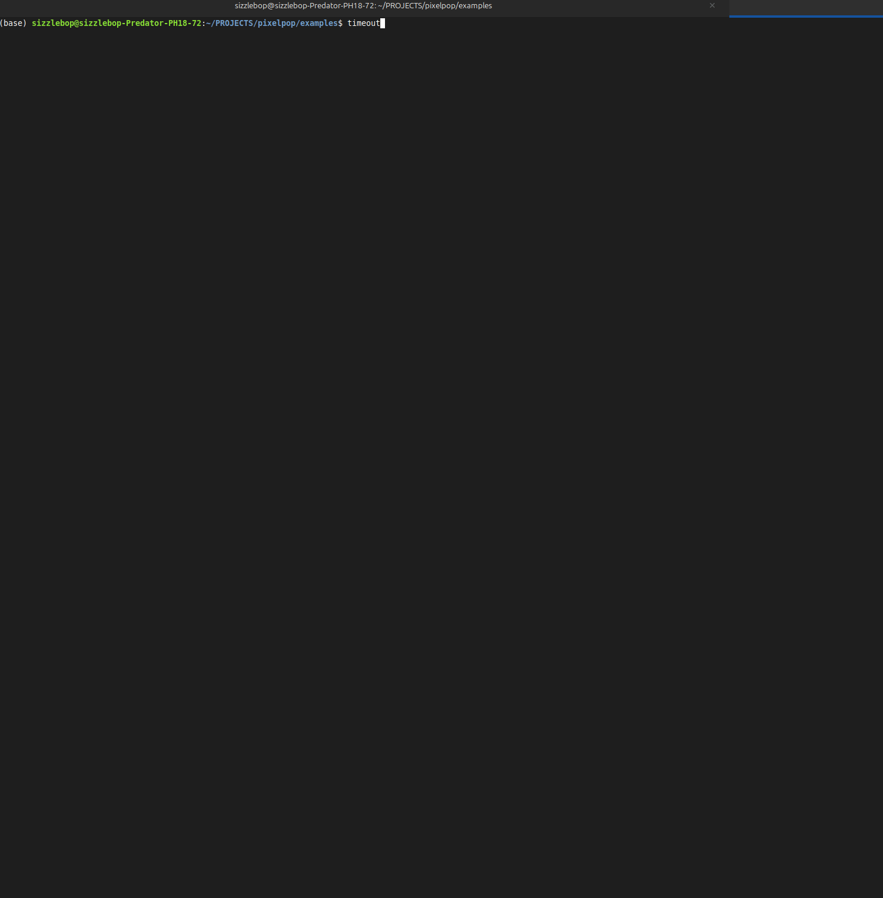

<div align="center">
  <h1>Pixelpop 🍭</h1>
  <h6>🖼️ Display and animate images, GIFs, and photo sequences directly in your terminal with ANSI color support 🖥️</h6>
  
  
  [](https://badge.fury.io/js/%40pinkpixel%2Fpixelpop) [](https://opensource.org/licenses/Apache-2.0) [](https://nodejs.org/) [](https://www.typescriptlang.org/) [](https://www.npmjs.com/package/@pinkpixel/pixelpop) [](https://github.com/pinkpixel-dev/pixelpop)
  
</div>

Pixelpop is a sophisticated terminal utility library that brings visual content to command-line applications. With intelligent terminal detection and multiple rendering strategies, it ensures your images look great across different terminal environments.

## 🎬 Demos

<div align="center">
  <h3>Static Image Display</h3>
  
  
  <h3>Animated GIF Playback</h3>
  
</div>

## ✨ Features

- 🖼️ **Multi-format Support** - Display JPEG, PNG, GIF, and more
- 🎬 **GIF Animation** - Smooth animated GIF playback with frame rate control
- 🎯 **Smart Terminal Detection** - Automatically adapts to your terminal's capabilities
- 📐 **Flexible Sizing** - Percentage-based dimensions with aspect ratio preservation
- 🌈 **Universal Compatibility** - Works in iTerm2, Kitty, WezTerm, and standard terminals
- ⚡ **High Performance** - Optimized rendering with intelligent fallbacks
- 🔧 **TypeScript Ready** - Full type definitions included

## 🚀 Quick Start

### Installation

```bash
# Using npm
npm install @pinkpixel/pixelpop

# Using yarn  
yarn add @pinkpixel/pixelpop

# Using pnpm
pnpm add @pinkpixel/pixelpop
```

Note: `@pinkpixel/pixelpop` is ESM-only (`"type": "module"`). Use ESM in your project, or use dynamic `import()` from CommonJS if needed.

### Basic Usage

```typescript
import pixelPop from '@pinkpixel/pixelpop';

// Display a static image
const output = await pixelPop.file('./my-image.jpg', {
  width: '50%'
});
console.log(output);

// Play an animated GIF
const stop = await pixelPop.gifFile('./my-animation.gif', {
  width: '80%',
  maximumFrameRate: 24
});

// Stop the animation after 5 seconds
setTimeout(stop, 5000);
```

## 📖 API Reference

### Static Image Methods

#### `pixelPop.file(filePath, options?)`
Display an image from a file path.

```typescript
await pixelPop.file('./image.jpg', {
  width: '60%',
  height: 20,
  preserveAspectRatio: true
});
```

#### `pixelPop.buffer(buffer, options?)`
Display an image from a buffer.

```typescript
const imageBuffer = fs.readFileSync('./image.jpg');
await pixelPop.buffer(imageBuffer, { width: '50%' });
```

### Animated GIF Methods

#### `pixelPop.gifFile(filePath, options?)`
Play an animated GIF from a file path. Returns a function to stop the animation.

```typescript
const stop = await pixelPop.gifFile('./animation.gif', {
  width: '75%',
  maximumFrameRate: 30
});
```

#### `pixelPop.gifBuffer(buffer, options?)`
Play an animated GIF from a buffer. Returns a function to stop the animation.

```typescript
const gifBuffer = fs.readFileSync('./animation.gif');
const stop = await pixelPop.gifBuffer(gifBuffer, {
  maximumFrameRate: 15
});
```

### Options

#### `RenderOptions`
```typescript
interface RenderOptions {
  width?: DimensionValue;        // number or percentage string like '50%'
  height?: DimensionValue;       // number or percentage string like '50%'  
  preserveAspectRatio?: boolean; // default: true
}
```

#### `GifOptions`
```typescript
interface GifOptions extends RenderOptions {
  maximumFrameRate?: number;  // default: 30
  renderFrame?: RenderFrame;  // custom frame renderer
}
```

#### `DimensionValue`
```typescript
type DimensionValue = number | `${number}%`;
```

## 🎯 Examples

### Responsive Image Display
```typescript
import pixelPop from '@pinkpixel/pixelpop';

// Adapt to terminal size
await pixelPop.file('./hero-image.jpg', {
  width: '100%',
  preserveAspectRatio: true
});
```

### Controlled GIF Animation
```typescript
import pixelPop from '@pinkpixel/pixelpop';

const stop = await pixelPop.gifFile('./loading.gif', {
  width: '25%',
  maximumFrameRate: 20
});

// Stop after process completes
await someAsyncOperation();
stop();
```

### Custom Frame Rendering
```typescript
import pixelPop from '@pinkpixel/pixelpop';
import logUpdate from 'log-update';

const customRenderer = (frame: string) => {
  logUpdate(`\n🎬 Animation Frame:\n${frame}`);
};

customRenderer.done = () => {
  logUpdate.done();
  console.log('Animation complete!');
};

await pixelPop.gifFile('./demo.gif', {
  renderFrame: customRenderer,
  maximumFrameRate: 24
});
```

### Buffer Processing
```typescript
import pixelPop from '@pinkpixel/pixelpop';
import { promises as fs } from 'fs';

const imageBuffer = await fs.readFile('./screenshot.png');
const output = await pixelPop.buffer(imageBuffer, {
  width: 80,
  height: '50%'
});

console.log(output);
```

## 🏗️ How It Works

Pixelpop uses a sophisticated multi-strategy rendering approach:

### 1. **Terminal Detection**
Automatically detects your terminal's capabilities by checking environment variables:
- `TERM_PROGRAM` (iTerm2, WezTerm, etc.)
- `TERM` (xterm-kitty, etc.)
- `KITTY_WINDOW_ID` and `KONSOLE_VERSION`

### 2. **Rendering Strategies**

#### 🏆 **Native Support** (iTerm2, etc.)
Uses `term-img` for terminals with built-in image protocols.

#### ⚡ **Kitty Protocol** (Kitty, WezTerm, Konsole)
Direct image rendering using Kitty's graphics protocol for superior quality.

#### 🌈 **ANSI Fallback** (Universal)
Block character rendering with RGB colors using Chalk - works everywhere!

### 3. **GIF Processing**
- FFmpeg-based frame extraction to temporary files
- Controlled animation loop with configurable frame rates
- Automatic cleanup of temporary resources

## 🎨 Terminal Compatibility

| Terminal | Strategy | Quality |
|----------|----------|---------|
| iTerm2 | Native | ⭐⭐⭐⭐⭐ |
| Kitty | Kitty Protocol | ⭐⭐⭐⭐⭐ |
| WezTerm | Kitty Protocol | ⭐⭐⭐⭐⭐ |
| Warp | ANSI Fallback | ⭐⭐⭐⭐ |
| Konsole | Kitty Protocol | ⭐⭐⭐⭐ |
| Terminal.app | ANSI Fallback | ⭐⭐⭐ |
| Windows Terminal | ANSI Fallback | ⭐⭐⭐ |
| Standard xterm | ANSI Fallback | ⭐⭐⭐ |

## 🛠️ Development

### Prerequisites
- Node.js >= 20
- npm, yarn, or pnpm

### Setup
```bash
git clone https://github.com/pinkpixel-dev/pixelpop.git
cd pixelpop
npm install
```

### Build
```bash
npm run build     # Compile TypeScript
npm run clean     # Clean dist directory
npm run prepare   # Full build (runs automatically on install)
```

### Code Quality
```bash
npm run lint      # Run ESLint
npm run lint:fix  # Fix ESLint issues
npm run typecheck # TypeScript validation
```

### Examples
Examples in `examples/` are TypeScript. Run them with a TS runner like `tsx` or `ts-node`, or copy snippets into your own app:

```bash
npm run build

# Using tsx (recommended)
npx tsx examples/example.ts          # Static image demo
npx tsx examples/example_gif.ts      # Animated GIF demo

# Or using ts-node (if installed)
node --loader ts-node/esm examples/example.ts
node --loader ts-node/esm examples/example_gif.ts
```

## 📚 Documentation

Pixelpop includes comprehensive documentation with detailed guides, examples, and API references. Visit the [`/docs`](./docs) directory for complete documentation:

- **[📖 Getting Started Guide](./docs/getting-started.md)** - Installation, basic usage, and core concepts
- **[🎯 API Reference](./docs/api-reference.md)** - Complete method documentation, types, and interfaces
- **[🎬 GIF Animation Guide](./docs/gif-animation.md)** - Advanced animation techniques and performance optimization
- **[🎨 Terminal Compatibility](./docs/terminal-compatibility.md)** - Terminal-specific optimizations and troubleshooting
- **[💡 Examples & Recipes](./docs/examples.md)** - Real-world usage patterns and integration examples

### Quick API Overview

```typescript
// Static images
await pixelPop.file(filePath, options?)     // Display image from file
await pixelPop.buffer(buffer, options?)     // Display image from buffer

// Animated GIFs  
const stop = await pixelPop.gifFile(filePath, options?)   // Play GIF from file
const stop = await pixelPop.gifBuffer(buffer, options?)   // Play GIF from buffer

// All methods support:
// - width/height: number | '50%' (percentage or pixels)
// - preserveAspectRatio: boolean (default: true)
// - maximumFrameRate: number (GIFs only, default: 30)
// - renderFrame: custom renderer function (GIFs only)
```

## 🤝 Contributing

We welcome contributions! Please see our [Contributing Guide](CONTRIBUTING.md) for details.

### Development Workflow
1. Fork the repository
2. Create a feature branch: `git checkout -b feature/amazing-feature`
3. Make your changes and add tests
4. Run the test suite: `npm test`
5. Commit your changes: `git commit -m 'Add amazing feature'`
6. Push to the branch: `git push origin feature/amazing-feature`
7. Open a Pull Request

## 📄 License

This project is licensed under the Apache License 2.0 - see the [LICENSE](LICENSE) file for details.

## ✨ Created by Pink Pixel

**Website**: [https://pinkpixel.dev](https://pinkpixel.dev)
**Email**: admin@pinkpixel.dev

---

<div align="center">
  <p><strong>Made with ❤️ by Pink Pixel</strong></p>
  <p>⭐ Star this repo if you find it useful!</p>
</div>
